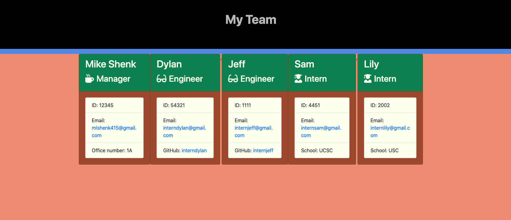

## Github URL:
https://github.com/mlshenk/template-engine-employee-summary

## Demo video: 
https://www.youtube.com/watch?v=rFAlSRJAVaU

## Description:
This assignment used two NPMs (jest & inquirer) to promp the user to create an office team roster for a group of employees. The user is prompted when they run 'node app.js' to select an employee level to add. For each position, the user will be prompted to input the employee's name, employee ID, email, and either office number (for the manager), school (for interns), or github username (for engineers). The final question for each position is specific to the role. The information for each employee is added to the global employee array as they are added, and the user is prompted to add another employee. When the user is finished adding employees, a team.html file is generated that lists the employee information in organized, styled, and easy-to-read cards. This assignment utilized node, TDD, and OOPs in order to make sure the code is functioning and clean. 

## Screenshot
 